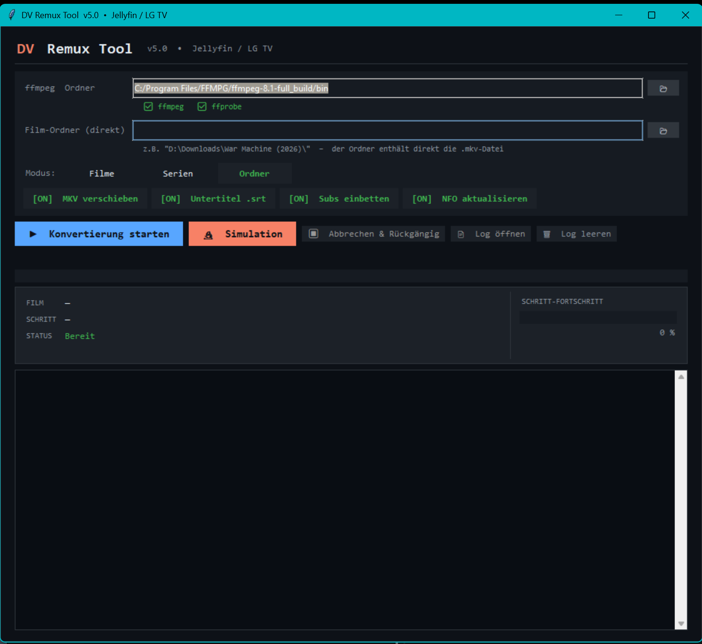

# DV Remux Tool

GUI-Tool für **Batch-Remux von Dolby-Vision-MKV-Dateien zu MP4** — ohne Re-Encoding, optimiert für **Jellyfin** und **LG TV**.



---

## Inhalt

- [Funktionen](#funktionen)
- [Voraussetzungen](#voraussetzungen)
- [Installation](#installation)
- [Erster Start](#erster-start)
- [Bedienungsanleitung](#bedienungsanleitung)
  - [1. ffmpeg-Ordner setzen](#1-ffmpeg-ordner-setzen)
  - [2. Modus wählen: Filme / Serien / Ordner](#2-modus-wählen-filme--serien--ordner)
  - [3. Optionen umschalten](#3-optionen-umschalten)
  - [4. Konvertierung starten oder simulieren](#4-konvertierung-starten-oder-simulieren)
  - [5. Abbrechen & Rückgängig](#5-abbrechen--rückgängig)
  - [6. Logs](#6-logs)
- [Erwartete Ordner-Struktur](#erwartete-ordner-struktur)
- [Konfigurationsdatei](#konfigurationsdatei)
- [Wie funktioniert das Remux?](#wie-funktioniert-das-remux)
- [Hinweise zu Dolby Vision](#hinweise-zu-dolby-vision)
- [Troubleshooting](#troubleshooting)
- [Lizenz](#lizenz)

---

## Funktionen

- **Verlustfreies Remux** von MKV → MP4 (`-c copy`, kein Re-Encoding, kein Qualitätsverlust)
- HEVC-Tag-Korrektur auf `hvc1` für **LG TV-Kompatibilität**
- `+faststart` für **schnelles Streaming-Start** in Jellyfin
- **Drei Modi:**
  - **Filme** — verarbeitet alle Unterordner eines Root-Verzeichnisses (ein MKV pro Ordner)
  - **Serien** — rekursive Verarbeitung von Staffel/Episode-Strukturen
  - **Ordner** — verarbeitet genau einen einzelnen Film-Ordner (Direktauswahl)
- **Untertitel-Extraktion** als externe `.srt`-Dateien (subrip, ass, ssa, webvtt, mov_text, srt)
- **Untertitel einbetten** als `mov_text` direkt in die MP4
- **NFO-Aktualisierung** (tinyMediaManager-kompatibel) inklusive Backup als `movie.nfo.bak`
- **Simulationsmodus** — komplette Vorschau ohne Dateien anzufassen
- **Rollback / Undo** — bei Abbruch oder Fehler werden erstellte Dateien automatisch entfernt
- **Live-Fortschritt**, farbiger Log, separater Schritt-Fortschritt
- **Dark Theme** (GitHub-Farbschema)

---

## Voraussetzungen

| Komponente | Version | Hinweis |
|---|---|---|
| Python | 3.8+ | `tkinter` ist im Lieferumfang |
| ffmpeg | aktuell | nur im Echtlauf nötig |
| ffprobe | aktuell | nur im Echtlauf nötig |

Im **Simulationsmodus** sind weder ffmpeg noch ffprobe erforderlich — ideal zum Testen der Pipeline.

ffmpeg-Download: <https://ffmpeg.org/download.html>

---

## Installation

```bash
git clone https://github.com/Hero9774/DolbyVision-Remux.git
cd DolbyVision-Remux
python dv_remux_gui.py
```

Optional: Beispiel-Konfig kopieren:

```bash
cp dv_remux_config.example.json dv_remux_config.json
```

---

## Erster Start

Beim allerersten Start ist die GUI leer. Du musst lediglich:

1. den **ffmpeg-Ordner** angeben (siehe unten),
2. einen **Root-Ordner** oder **Film-Ordner** wählen,
3. den passenden **Modus** auswählen.

Alle Einstellungen werden beim Beenden automatisch in `dv_remux_config.json` gespeichert.

---

## Bedienungsanleitung

### 1. ffmpeg-Ordner setzen

Im Feld **„ffmpeg Ordner"** den Pfad zum `bin/`-Verzeichnis deiner ffmpeg-Installation eintragen oder über das Ordner-Symbol auswählen.

Beispiel: `C:/Program Files/FFMPG/ffmpeg-8.1-full_build/bin`

Die GUI zeigt durch grüne Häkchen, ob `ffmpeg` und `ffprobe` gefunden wurden:

- ✅ ffmpeg
- ✅ ffprobe

Sind beide gefunden, kannst du im Echtlauf starten. Fehlt eines, erscheint eine Warnung — der Simulationsmodus läuft trotzdem.

### 2. Modus wählen: Filme / Serien / Ordner

| Modus | Verhalten | Eingabefeld |
|---|---|---|
| **Filme** | Verarbeitet **alle Unterordner** des angegebenen Root. Erwartet eine MKV pro Unterordner. | Root-Ordner (z. B. `Y:/Shared Movies`) |
| **Serien** | Geht **rekursiv** durch Staffel-/Episoden-Struktur. `trickplay`-Ordner werden übersprungen. | Root-Ordner (z. B. `Y:/Shared Series`) |
| **Ordner** | Verarbeitet **genau einen** Film-Ordner, der direkt eine MKV enthält. | Film-Ordner (direkt) |

Der gewählte Modus blendet automatisch das passende Eingabefeld ein.

### 3. Optionen umschalten

Vier Toggle-Buttons (`[ON]` / `[OFF]`):

| Option | Beschreibung |
|---|---|
| **MKV verschieben** | Original-MKV wird **behalten** (verschoben/umbenannt) statt gelöscht. Empfohlen, bis du das Ergebnis geprüft hast. |
| **Untertitel .srt** | Text-basierte Untertitel werden als externe `.srt`-Datei neben der MP4 abgelegt. |
| **Subs einbetten** | Extrahierte Untertitel werden als `mov_text`-Stream in die MP4 eingebettet (kann mit `Untertitel .srt` kombiniert werden). |
| **NFO aktualisieren** | `movie.nfo` wird aktualisiert: `original_filename` `.mkv` → `.mp4`, `<subtitle>`-Einträge in `<streamdetails>` neu gesetzt. Vor jeder Änderung wird `movie.nfo.bak` angelegt. |

Nur Text-Codecs werden für SRT-Extraktion akzeptiert: `subrip`, `ass`, `ssa`, `webvtt`, `mov_text`, `text`, `srt`. Bild-basierte Untertitel (PGS / VobSub) werden übersprungen.

### 4. Konvertierung starten oder simulieren

| Button | Aktion |
|---|---|
| **▶ Konvertierung starten** | Startet den **Echtlauf** — ruft ffmpeg auf, schreibt MP4-Dateien, ändert NFO. |
| **🔬 Simulation** | Startet den **Simulationsmodus** — keine Datei wird angefasst. Stattdessen wird jede geplante Aktion als `[SIM]` ins Log geschrieben. Untertitel-Streams werden aus der NFO gelesen. |

Beide Modi laufen in einem **Background-Thread**, die GUI bleibt während des Laufs reaktionsfähig.

Während der Konvertierung zeigt die GUI:

- **FILM** — aktueller Filmtitel
- **SCHRITT** — aktuelle Aktion (Analyse, Remux, SRT, NFO …)
- **STATUS** — `Bereit` / `Läuft` / `Fertig` / `Fehler`
- **SCHRITT-FORTSCHRITT** — Prozent-Balken für den aktuellen Schritt
- Großer Gesamt-Fortschrittsbalken oben

### 5. Abbrechen & Rückgängig

**⏹ Abbrechen & Rückgängig** stoppt den laufenden Prozess sauber:

1. ffmpeg-Subprozess wird beendet (`process.terminate()`).
2. Der bisher geführte **Undo-Log** wird abgearbeitet:
   - erzeugte `.mp4` werden gelöscht,
   - extrahierte `.srt` werden gelöscht,
   - geänderte `.nfo` werden aus dem `.bak` wiederhergestellt.

Das Tool versucht damit, einen sauberen Vorzustand wiederherzustellen.

### 6. Logs

- **📄 Log öffnen** — öffnet die zuletzt erzeugte Log-Datei im Standard-Editor.
- **🗑 Log leeren** — leert das Log-Fenster (nicht die Datei).

Log-Dateien liegen in `logs/`:

- Echtlauf: `dv_remux_RUN_YYYYMMDD_HHMMSS.log`
- Simulation: `dv_remux_SIM_YYYYMMDD_HHMMSS.log`

Im Log-Fenster sind die Einträge **farbig markiert**: `OK` (grün), `ERR` (rot), `SIM` (blau), `SKIP` (grau), `PROG`, `HEAD`.

---

## Erwartete Ordner-Struktur

### Modus „Filme"

```
Y:/Shared Movies/
├── Film A (2023)/
│   ├── Film A.mkv
│   └── movie.nfo          ← muss <hdrtype>dolbyvision</hdrtype> enthalten
├── Film B (2024)/
│   ├── Film B.mkv
│   └── movie.nfo
└── …
```

### Modus „Serien"

```
Y:/Shared Series/
└── Serie X/
    ├── Season 01/
    │   ├── Serie X - S01E01.mkv
    │   ├── Serie X - S01E01.nfo
    │   └── …
    └── Season 02/
        └── …
```

`trickplay`-Unterordner werden automatisch übersprungen.

### Modus „Ordner"

```
D:/Downloads/Film C (2025)/
├── Film C.mkv
└── movie.nfo
```

→ direkt diesen Ordner im Feld **„Film-Ordner (direkt)"** auswählen.

---

## Konfigurationsdatei

Beim Schließen wird `dv_remux_config.json` automatisch gespeichert:

```json
{
  "ffbin":      "C:/Program Files/FFMPG/ffmpeg-8.1-full_build/bin",
  "root":       "Y:/Shared Movies",
  "behalten":   true,
  "subs":       true,
  "nfo":        true,
  "modus":      "filme",
  "embed_subs": true
}
```

| Schlüssel | Bedeutung |
|---|---|
| `ffbin` | Ordner mit `ffmpeg.exe` und `ffprobe.exe` |
| `root` | Root-Verzeichnis (Filme/Serien) bzw. Einzel-Ordner |
| `behalten` | Original-MKV nach Remux behalten |
| `subs` | Untertitel als externe `.srt` extrahieren |
| `nfo` | `movie.nfo` aktualisieren |
| `modus` | `"filme"` \| `"serien"` \| `"ordner"` |
| `embed_subs` | Untertitel in MP4 einbetten |

Eine Beispieldatei findest du in [`dv_remux_config.example.json`](dv_remux_config.example.json).

---

## Wie funktioniert das Remux?

Das eigentliche Remux ist ein **simpler ffmpeg-Aufruf** ohne Re-Encoding:

```bash
ffmpeg -i "input.mkv" \
       -c copy \
       -tag:v hvc1 \
       -map 0:v -map 0:a \
       -movflags +faststart \
       "output.mp4"
```

| Flag | Wirkung |
|---|---|
| `-c copy` | Streams 1:1 kopieren — kein Re-Encoding, keine Qualitätsverluste |
| `-tag:v hvc1` | HEVC-Codec-Tag wird auf `hvc1` gesetzt (LG TV erwartet das, statt `hev1`) |
| `-map 0:v -map 0:a` | Nur Video- und Audio-Streams übernehmen |
| `-movflags +faststart` | `moov`-Atom an den Anfang verschieben → schnelles Streaming-Start |

Untertitel-Streams werden separat behandelt:

- Bei **„Untertitel .srt"** über `ffmpeg -map 0:s:N -c:s srt` als externe Datei extrahiert.
- Bei **„Subs einbetten"** als `-c:s mov_text` direkt in die MP4 gemappt.

---

## Hinweise zu Dolby Vision

Das Tool prüft, ob ein Film tatsächlich Dolby Vision ist — Filme **ohne** DV werden übersprungen.

Die Erkennung läuft zweistufig:

1. **Primär:** Aus `movie.nfo` — Tag `<hdrtype>dolbyvision</hdrtype>` (tinyMediaManager-Standard).
2. **Fallback:** ffprobe-Side-Data des Video-Streams (`DOVI configuration record`).

Wenn keine NFO existiert oder kein DV erkannt wird, wird der Film im Log als `[SKIP]` markiert.

> Hinweis: Das Tool **konvertiert keine DV-Profile**. Es kopiert die vorhandenen Streams unverändert. Profile wie DV 5, DV 7 oder DV 8 bleiben so wie sie in der MKV vorliegen. Für LG TVs ist hauptsächlich Profil 7/8 relevant — prüfe vor dem Remux, ob deine Quelle damit kompatibel ist.

---

## Troubleshooting

| Symptom | Ursache / Lösung |
|---|---|
| **„ffmpeg nicht gefunden"** | `ffbin`-Pfad zeigt nicht auf den Ordner mit `ffmpeg.exe`. Vollen Pfad zum `bin/`-Verzeichnis setzen. |
| **„Keine MKV gefunden"** | Im Modus „Ordner" enthält der gewählte Ordner keine `.mkv`-Datei. |
| **Film wird mit `[SKIP]` markiert** | Kein `<hdrtype>dolbyvision</hdrtype>` in `movie.nfo` und ffprobe findet keine DOVI-Side-Data. |
| **LG TV spielt MP4 nicht ab** | Prüfe, ob `-tag:v hvc1` gesetzt war (sollte automatisch passieren). Eventuell DV-Profil nicht von deinem TV unterstützt. |
| **NFO-Backup wiederherstellen** | `movie.nfo.bak` einfach zurück nach `movie.nfo` kopieren. |
| **MP4 hat keine Untertitel im Player** | „Subs einbetten" muss aktiv sein **und** der Quell-Subtitle-Codec muss text-basiert sein (subrip/ass/ssa/webvtt/mov_text/srt). PGS/VobSub werden übersprungen. |
| **Tool friert kurz ein** | Beim Start eines neuen Films läuft `ffprobe` — kann je nach Datei einige Sekunden dauern. |

Bei Fehlern lohnt sich immer ein Blick ins Log unter `logs/`.

---

## Lizenz

[MIT](LICENSE) © 2026 Hero9774
