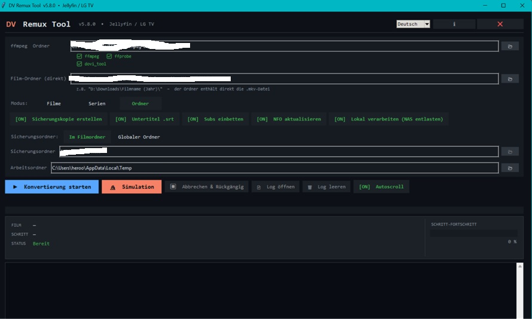

# DV Remux Tool

GUI tool for **batch-remuxing Dolby Vision MKV files to MP4** — without re-encoding, optimized for **Jellyfin** and **LG TV**.



---

## Contents

- [Features](#features)
- [Requirements](#requirements)
- [Installation](#installation)
- [First launch](#first-launch)
- [User guide](#user-guide)
  - [1. Set the ffmpeg folder](#1-set-the-ffmpeg-folder)
  - [2. Choose a mode: Movies / Series / Folder](#2-choose-a-mode-movies--series--folder)
  - [3. Toggle options](#3-toggle-options)
  - [4. Process locally (offload the NAS)](#4-process-locally-offload-the-nas)
  - [5. Start or simulate the conversion](#5-start-or-simulate-the-conversion)
  - [6. Cancel & undo](#6-cancel--undo)
  - [7. Logs](#7-logs)
  - [8. Language](#8-language)
  - [9. Video converter (sub-program)](#9-video-converter-sub-program)
- [Expected folder structure](#expected-folder-structure)
- [Configuration file](#configuration-file)
- [How does the remux work?](#how-does-the-remux-work)
- [Notes on Dolby Vision](#notes-on-dolby-vision)
- [Troubleshooting](#troubleshooting)
- [Changelog](#changelog)
- [Third-party components](#third-party-components)
- [License](#license)

---

## Features

- **Lossless remux** from MKV → MP4 (`-c copy`, no re-encoding, no quality loss)
- HEVC tag correction to `hvc1` for **LG TV compatibility**
- **DV configuration box** — the Dolby Vision Configuration Record (`dvvC` / `dvcC`) is written directly into the MP4 via a Python binary patch when ffmpeg has not already done so; without this box, Jellyfin / LG TV do not recognize DV in the MP4 container
- **Anamorphic correction** — sources with SAR ≠ 1:1 (which Jellyfin refuses to play directly) are corrected in the container without touching the bitstream, as long as the deviation stays below 1 %
- **DTS → E-AC3** — DTS cannot be stored in MP4 in a way hardware players accept; the affected tracks are converted to E-AC3 640k while everything else is copied unchanged
- **faststart + mp42** — moves the `moov` atom before `mdat` and sets `major_brand` to `mp42` for optimal player compatibility
- **DV Profile 5 → Profile 8.1 conversion** (blue-tint fix) via `dovi_tool -m 3 convert` — 5-step pipeline without re-encoding
- **Three modes:**
  - **Movies** — processes all subfolders of a root directory (one MKV per folder)
  - **Series** — recursive processing of season/episode structures
  - **Folder** — processes exactly one single movie folder (direct selection)
- **Process locally (offload NAS)** — moves the source to a local working folder, runs the whole pipeline there, and transfers only the finished MP4 back to the NAS
- **Video converter (sub-program)** — scans a folder, reports the resolution of every video file and converts everything that is not an MP4 into an LG-TV-friendly MP4, hardware-accelerated via **AMD AMF** (`h264_amf` / `hevc_amf`)
- **Subtitle extraction** as external `.srt` files (subrip, ass, ssa, webvtt, mov_text, srt)
- **Embed subtitles** as `mov_text` directly in the MP4
- **NFO update** (tinyMediaManager-compatible) including a backup as `movie.nfo.bak`
- **Multilingual UI** (German / English) — switchable live via a dropdown
- **Simulation mode** — a complete preview without touching any files
- **Rollback / undo** — created files are removed automatically on abort or error
- **Live progress**, colored log, separate per-step progress
- **Dark theme** (GitHub color scheme)

---

## Requirements

| Component | Version | Note |
|---|---|---|
| Python | 3.8+ | `tkinter` is included |
| ffmpeg | current | only needed for real runs |
| ffprobe | current | only needed for real runs |
| dovi_tool | current | **optional** — only for DV Profile 5 conversion |

In **simulation mode**, neither ffmpeg nor ffprobe is required — ideal for testing the pipeline.

ffmpeg download: <https://ffmpeg.org/download.html>

dovi_tool download: <https://github.com/quietvoid/dovi_tool/releases>
→ place `dovi_tool.exe` in the `tools/` folder. The GUI shows the status automatically.

---

## Installation

```bash
git clone https://github.com/Hero9774/DolbyVision-Remux.git
cd DolbyVision-Remux
python dv_remux_gui.py
```

Optional: copy the example config:

```bash
cp dv_remux_config.example.json dv_remux_config.json
```

---

## First launch

On the very first launch the GUI is empty. You only need to:

1. specify the **ffmpeg folder** (see below),
2. choose a **root folder** or **movie folder**,
3. select the appropriate **mode**.

All settings are saved automatically to `config/dv_remux_config.json` on exit.

---

## User guide

### 1. Set the ffmpeg folder

In the **"ffmpeg folder"** field, enter the path to the `bin/` directory of your ffmpeg installation, or select it via the folder icon.

Example: `C:/Program Files/FFMPG/ffmpeg-8.1-full_build/bin`

The GUI indicates with green checkmarks whether `ffmpeg` and `ffprobe` were found:

- ✅ ffmpeg
- ✅ ffprobe

If both are found, you can start a real run. If one is missing, a warning appears — simulation mode still works.

### 2. Choose a mode: Movies / Series / Folder

| Mode | Behavior | Input field |
|---|---|---|
| **Movies** | Processes **all subfolders** of the given root. Expects one MKV per subfolder. | Root folder (e.g. `Y:/Shared Movies`) |
| **Series** | Traverses a season/episode structure **recursively**. `trickplay` folders are skipped. | Root folder (e.g. `Y:/Shared Series`) |
| **Folder** | Processes **exactly one** movie folder that directly contains an MKV. | Movie folder (direct) |

The selected mode automatically shows the matching input field.

### 3. Toggle options

Toggle buttons (`[ON]` / `[OFF]`):

| Option | Description |
|---|---|
| **Create backup** | The original MKV is **kept** (moved into a backup folder) instead of being deleted. Recommended until you have verified the result. When off, the original is deleted without a backup. |
| **Subtitles .srt** | Text-based subtitles are written as external `.srt` files next to the MP4. |
| **Embed subs** | Extracted subtitles are embedded as a `mov_text` stream in the MP4 (can be combined with **Subtitles .srt**). |
| **DTS → E-AC3** | DTS tracks are converted to E-AC3 640k. Leave this on unless your player definitely handles DTS inside MP4 — most TVs refuse the whole file otherwise. |
| **Update NFO** | `movie.nfo` is updated: `original_filename` `.mkv` → `.mp4`, `<subtitle>` entries in `<streamdetails>` rewritten. A `movie.nfo.bak` is created before every change. |
| **Process locally (offload NAS)** | See the next section. |

Only text codecs are accepted for SRT extraction: `subrip`, `ass`, `ssa`, `webvtt`, `mov_text`, `text`, `srt`. Image-based subtitles (PGS / VobSub) are skipped.

The **backup folder** for the original MKV is selectable: "In movie folder" (an `old MKV` subfolder next to the movie) or a global folder (all originals go directly into the chosen path).

### 4. Process locally (offload the NAS)

When your movies live on a NAS, working directly on it is slow and generates a lot of network traffic (faststart in particular rewrites the whole 20–30 GB file NAS-internally).

With **"Process locally (offload NAS)"** enabled, the original MKV is **moved** to a local working folder (default: the Windows temp folder), the complete remux/P5→P8/dvcC/faststart pipeline runs there, and only the finished MP4 is transferred back to the NAS target folder. This is significantly faster and offloads the network.

Safety guarantees:

- The MKV is **moved, not copied** — this prevents Jellyfin from seeing MKV + MP4 as duplicates in the same NAS folder during processing. The copy is created completely and verified by file size before the NAS original is deleted (no data loss on abort during the copy).
- If any later step fails (remux error, failed back-transfer, cancel via the stop button), the original MKV is **automatically moved back** to its NAS origin before the run ends.
- If the transfer of the finished MP4 back to the NAS fails, it stays available locally (manually retrievable) instead of being lost.
- Before starting, the free disk space in the working folder is checked (buffer factor 2.3× the source size); if there is too little space, the movie is skipped instead of aborting.

`movie.nfo` and extracted `.srt` files always go directly to the NAS folder — only the heavy video processing happens locally.

### 5. Start or simulate the conversion

| Button | Action |
|---|---|
| **▶ Start conversion** | Starts a **real run** — invokes ffmpeg, writes MP4 files, changes NFO. |
| **🔬 Simulation** | Starts **simulation mode** — no file is touched. Instead, every planned action is written to the log as `[SIM]`. Subtitle streams are read from the NFO. |

Both modes run in a **background thread**; the GUI stays responsive during the run.

During conversion the GUI shows:

- **FILM** — current movie title
- **STEP** — current action (analysis, remux, SRT, NFO …)
- **STATUS** — `Ready` / `Running` / `Done` / `Error`
- **STEP PROGRESS** — percentage bar for the current step
- Large overall progress bar at the top

### 6. Cancel & undo

**⏹ Cancel & undo** stops the running process cleanly:

1. The ffmpeg subprocess is terminated (`process.terminate()`).
2. The undo log gathered so far is processed:
   - created `.mp4` files are deleted,
   - extracted `.srt` files are deleted,
   - changed `.nfo` files are restored from the `.bak`.

This attempts to restore a clean previous state.

### 7. Logs

- **📄 Open log** — opens the most recently created log file in the default editor.
- **🗑 Clear log** — clears the log window (not the file).

Log files live in `logs/`:

- Real run: `dv_remux_RUN_YYYYMMDD_HHMMSS.log`
- Simulation: `dv_remux_SIM_YYYYMMDD_HHMMSS.log`

In the log window entries are **color-coded**: `OK` (green), `ERR` (red), `SIM` (blue), `SKIP` (gray), `PROG`, `HEAD`. Written log files follow the language that was active at the time each line was produced.

### 8. Language

A dropdown in the title bar switches the interface between **German** and **English**. The change takes effect **immediately** across the whole GUI as well as on all log/error messages, without a restart. The selection is stored in the config (key `sprache`). All texts live in `lang/de.json` and `lang/en.json`.

### 9. Video converter (sub-program)

The **🎬 Video converter** button (right-hand side of the button bar) opens a separate window for everything that is *not* a Dolby Vision remux: old home videos, WMV/AVI/MPG collections, downloads in odd containers.

**All paths come from the main window** — source folder (`root`), working folder (`lokale_kopie_pfad`), backup folder (`old_mkv_pfad`) and the ffmpeg folder are the same fields; editing one changes both windows. There is no second set of path settings.

It works in two phases:

1. **Scan** — every file in the folder is analysed with ffprobe; the log lists resolution, SAR, frame rate, codec and scan type (interlaced/progressive) per file, plus the resulting output resolution.
2. **Convert** — everything that is not already an `.mp4` is re-encoded into an MP4 that an LG TV plays with working fast-forward/seeking. `.mkv` files are **ignored** here (they belong to the remux part).

| Option | Meaning |
|---|---|
| **AMD acceleration** | Uses `hevc_amf` / `h264_amf`. Availability is verified with a real 1-second test encode at start (not just `ffmpeg -encoders`); if the GPU path fails, `libx265` / `libx264` are used instead — per file, if a single source trips up the hardware encoder |
| **Fix anamorphic** | MPEG/DVD/WMV sources often have non-square pixels (SAR ≠ 1:1). With this option the picture is rescaled to square pixels, otherwise the TV shows it distorted |
| **Process locally** | Like the remux part: the original is moved to the working folder, converted there, and only the finished MP4 goes back to the source folder. This offloads the NAS. On any error — encode failure, failed transfer back, stop button — the original is moved back to its source location automatically |
| **Include subfolders** | Also walks all subdirectories |
| **Keep original** | ON: the original is backed up after a successful conversion (into the main window's backup folder if that is set to *global*, otherwise into an `old video` subfolder). OFF (default): the original is deleted |
| **Target codec** | **HEVC (default)**, H.264, or `Auto` (H.264 up to 1080p, HEVC above) |
| **Quality** | High / Medium / Small — target bitrate for 1080p25 HEVC: 6 / 4 / 2.5 Mbit/s, scaled sub-linearly by resolution and frame rate, with a 1.6× surcharge for H.264 |

Bitrate control (peak VBR) is used deliberately instead of a constant quantizer: noisy old sources can end up *larger* than the original at constant quality, whereas a target bitrate keeps the output size predictable.

Output profile: HEVC Main with the `hvc1` tag resp. H.264 High, `yuv420p`, AAC audio (stream-copied when the source is already AAC), `-movflags +faststart` and a fixed 2-second keyframe interval so seeking is smooth. Interlaced sources are deinterlaced with `yadif`, since AMF only encodes progressively. The source resolution is preserved — the only change is the anamorphic correction above.

Files that already are `.mp4`, `.mkv` files, files whose target `.mp4` exists and files of unknown type are skipped and logged as `SKIP`. The window has its own log, its own stop button and its own log file (`logs/konverter_*.log`) and runs independently of the main remux window. Simulation mode works here too: resolutions are detected for real, nothing is written.

---

## Expected folder structure

### "Movies" mode

```
Y:/Shared Movies/
├── Movie A (2023)/
│   ├── Movie A.mkv
│   └── movie.nfo          ← must contain <hdrtype>dolbyvision</hdrtype>
├── Movie B (2024)/
│   ├── Movie B.mkv
│   └── movie.nfo
└── …
```

### "Series" mode

```
Y:/Shared Series/
└── Show X/
    ├── Season 01/
    │   ├── Show X - S01E01.mkv
    │   ├── Show X - S01E01.nfo
    │   └── …
    └── Season 02/
        └── …
```

`trickplay` subfolders are skipped automatically.

### "Folder" mode

```
D:/Downloads/Movie C (2025)/
├── Movie C.mkv
└── movie.nfo
```

→ select this folder directly in the **"Movie folder (direct)"** field.

---

## Configuration file

On exit, `config/dv_remux_config.json` is saved automatically (the `config/` folder is created automatically on first launch):

```json
{
  "ffbin":             "C:/Program Files/FFMPG/ffmpeg-8.1-full_build/bin",
  "root":              "Y:/Shared Movies",
  "behalten":          true,
  "subs":              true,
  "nfo":               true,
  "modus":             "filme",
  "embed_subs":        true,
  "dts_eac3":          true,
  "old_mkv_modus":     "lokal",
  "old_mkv_pfad":      "",
  "lokale_kopie":      false,
  "lokale_kopie_pfad": "",
  "sprache":           "en",
  "konv_rekursiv":     false,
  "konv_behalten":     false,
  "konv_amd":          true,
  "konv_sar":          true,
  "konv_codec":        "hevc",
  "konv_qualitaet":    "mittel",
  "konv_lokal":        true
}
```

| Key | Meaning |
|---|---|
| `ffbin` | Folder containing `ffmpeg.exe` and `ffprobe.exe` |
| `root` | Root directory (movies/series) or single folder |
| `behalten` | Keep the original MKV as a backup after remux |
| `subs` | Extract subtitles as external `.srt` |
| `nfo` | Update `movie.nfo` |
| `modus` | `"filme"` \| `"serien"` \| `"ordner"` |
| `embed_subs` | Embed subtitles in the MP4 |
| `dts_eac3` | Convert DTS audio tracks to E-AC3 640k (default `true`) |
| `old_mkv_modus` | Backup target: `"lokal"` (in movie folder) or `"global"` |
| `old_mkv_pfad` | Global backup folder path (when `old_mkv_modus` = `"global"`) |
| `lokale_kopie` | Process locally in a working folder (offload NAS) |
| `lokale_kopie_pfad` | Local working folder path (defaults to the Windows temp folder) |
| `sprache` | UI language: `"en"` \| `"de"` |
| `konv_rekursiv` | Video converter: include subfolders |
| `konv_behalten` | Video converter: back up the original (`false` = delete it after conversion) |
| `konv_amd` | Video converter: use the AMD AMF hardware encoder |
| `konv_sar` | Video converter: rescale anamorphic sources to square pixels |
| `konv_codec` | Video converter: `"hevc"` (default) \| `"h264"` \| `"auto"` |
| `konv_qualitaet` | Video converter: `"hoch"` \| `"mittel"` \| `"klein"` |
| `konv_lokal` | Video converter: process in the working folder instead of directly at the source |

> The video converter has no path keys of its own — it uses `root`, `lokale_kopie_pfad`, `old_mkv_pfad` and `ffbin` from the main window.

An example file is available in [`dv_remux_config.example.json`](dv_remux_config.example.json).

> Note: the config keys are kept in German for backward compatibility with existing config files.

---

## How does the remux work?

### Normal DV path (Profile 7 / 8)

The remux process runs in **three phases**:

**Phase 1 — ffmpeg (without faststart):**
```bash
ffmpeg -i "input.mkv" -c copy -tag:v hvc1 -map 0:v -map 0:a "output.mp4"
```

| Flag | Effect |
|---|---|
| `-c copy` | Copy streams 1:1 — no re-encoding, no quality loss |
| `-tag:v hvc1` | Set the HEVC codec tag to `hvc1` (LG TV expects this instead of `hev1`) |
| `-map 0:v -map 0:a` | Keep only video and audio streams |

| `-aspect W:H` | Only for slightly anamorphic sources — see below |
| `-c:a:N eac3 -b:a:N 640k` | Only for DTS tracks — see below |

**Anamorphic sources.** Some releases carry a sample aspect ratio ≠ 1:1 (e.g. 3840×2080 with SAR 481:480, to hit exactly 1.85:1). ffmpeg then writes a `pasp` box into the MP4, and Jellyfin refuses direct playback with *"anamorphic video is not supported"*. If the deviation is at most 1 % the tool corrects it with `-aspect` — that changes only the container's `pasp` box, which takes precedence over the VUI for ffprobe and therefore for Jellyfin. Above that threshold (real anamorphic material such as PAL DVD with SAR 16:15) the stream is **left untouched** and only a warning is logged, because correcting it there would visibly distort the picture and fixing it properly would require re-encoding.

> **Do not "improve" this with `-bsf:v hevc_metadata=sample_aspect_ratio=1/1`.** The filter re-serializes VPS/SPS/PPS, and with Dolby Vision material the RPU no longer matches the parameter sets afterwards. ffmpeg still decodes the file without complaint, but on a TV the picture disintegrates into colour smears — verified on an LG G4. The container-only route provably leaves every VPS/SPS/PPS and every RPU NAL untouched.

**DTS audio.** ffmpeg can only store DTS inside MP4 as an `mp4a` sample entry with an esds descriptor (objectTypeIndication 0xA9); a proper `dtsc` entry is rejected outright (*"codec not currently supported in container"*). Hardware players do not recognize that construction and refuse the **entire file**, even models that do support DTS — again verified on an LG G4, where the same file with E-AC3 plays perfectly including Dolby Vision. With the **DTS → E-AC3** toggle enabled (default) DTS tracks are converted to E-AC3 640k while every other track is still copied unchanged, as is the video.

**Phase 2 — the Dolby Vision configuration box** (Python binary patch, no external tool):

The tool navigates the path `trak → mdia → minf → stbl → stsd → hvc1/dvh1` inside the `moov` atom and inserts a 32-byte configuration record directly after the `hvcC` box — named `dvvC` in an `hvc1`/`hev1` entry (cross-compatible profiles 8.x) and `dvcC` in a `dvh1`/`dvhe` entry, as the Dolby ISOBMFF specification requires. Without this box, Jellyfin and LG TV do not recognize Dolby Vision in the MP4 container. Current ffmpeg versions already write `dvvC` themselves; if either box is present, nothing is injected.

**Phase 3 — faststart + mp42** (Python, no ffmpeg):

`moov` is moved before `mdat` and `major_brand` is set to `mp42`. The `stco`/`co64` chunk offsets are corrected accordingly.

Subtitle streams are handled separately:

- With **"Subtitles .srt"**, extracted via `ffmpeg -map 0:s:N -c:s srt` as an external file.
- With **"Embed subs"**, mapped directly into the MP4 as `-c:s mov_text`.

---

## Notes on Dolby Vision

The tool checks whether a movie is actually Dolby Vision — movies **without** DV are skipped.

Detection is two-stage:

1. **Primary:** from `movie.nfo` — tag `<hdrtype>dolbyvision</hdrtype>` (tinyMediaManager standard).
2. **Fallback:** ffprobe side-data of the video stream (`DOVI configuration record`).

If no NFO exists or no DV is detected, the movie is marked as `[SKIP]` in the log.

### DV Profile 5 conversion (blue-tint fix)

**Dolby Vision Profile 5** (typical for WEB-DL releases, recognizable by `dvhe.05` / `IPT-PQ-C2` in MediaInfo) uses the **ICtCp color space** instead of standard YUV. Devices without a native DV decoder interpret this data as YUV — the result is a strong **color/blue tint**.

If `dovi_tool.exe` is present in `tools/`, a **5-step pipeline** runs fully automatically:

| Step | Action |
|---|---|
| **[1/5] Extract HEVC** | `ffmpeg -c:v copy -an -sn` → `%TEMP%\_dv_remux_*.hevc` |
| **[2/5] RPU P5 → P8.1** | `dovi_tool -m 3 convert` — mode 3 is explicitly for Profile 5 → 8.1 |
| **[3/5] Assemble MP4** | P8 HEVC + audio from the original MKV, `-tag:v dvh1`, no faststart |
| **[4/5] DV config box** | Dolby Vision Configuration Record (Profile 8.1, level auto, compat_id=1) — skipped when ffmpeg already wrote one |
| **[5/5] faststart + mp42** | `moov` before `mdat`, `major_brand = mp42` |

The DV level in the configuration box is calculated automatically from resolution and frame rate. Temp files in `%TEMP%` are cleaned up in every case. If `dovi_tool.exe` is missing, the normal remux runs through — with a warning in the log.

**Profile 5 detection** (three-stage, without NFO):
1. `dv_profile` directly from `ffprobe` stream side-data
2. `dv_bl_signal_compatibility_id == 0` → typical for Profile 5 (no HDR10 fallback)
3. Frame-level fallback via `ffprobe -read_intervals %+#1 -show_frames`

---

## Troubleshooting

| Symptom | Cause / solution |
|---|---|
| **"ffmpeg not found"** | The `ffbin` path does not point to the folder containing `ffmpeg.exe`. Set the full path to the `bin/` directory. |
| **"No MKV found"** | In "Folder" mode, the chosen folder contains no `.mkv` file. |
| **A movie is marked `[SKIP]`** | No `<hdrtype>dolbyvision</hdrtype>` in `movie.nfo` and ffprobe finds no DOVI side-data. |
| **LG TV does not play the MP4** | The DV configuration box and mp42 are set automatically. For older outputs: reprocess the MP4. |
| **Jellyfin: "anamorphic video is not supported"** | The source has a sample aspect ratio ≠ 1:1. Since v5.9 slightly anamorphic sources (≤ 1 % deviation) are normalized automatically — reprocess the MP4 from the original MKV. For strongly anamorphic material (e.g. PAL DVD, SAR 16:15) only re-encoding helps; the video converter does exactly that. |
| **TV does not recognize the MP4 at all** | Most likely a DTS track: ffmpeg can only write DTS into MP4 as `mp4a`/esds, which players reject. Enable **DTS → E-AC3** and reprocess from the MKV. |
| **Colour smears / broken picture on the TV, but ffmpeg decodes fine** | The HEVC bitstream was modified (e.g. by a metadata bitstream filter) and the Dolby Vision RPU no longer matches the parameter sets. Reprocess from the original MKV. |
| **Restore the NFO backup** | Simply copy `movie.nfo.bak` back to `movie.nfo`. |
| **MP4 has no subtitles in the player** | "Embed subs" must be enabled **and** the source subtitle codec must be text-based (subrip/ass/ssa/webvtt/mov_text/srt). PGS/VobSub are skipped. |
| **The tool freezes briefly** | When a new movie starts, `ffprobe` runs — depending on the file this can take a few seconds. |

When errors occur, it is always worth checking the log under `logs/`.

---

## Changelog

### v5.9.0
- **Video converter** as a sub-program in its own window (button 🎬 in the main window): scans a folder, reports every file's resolution and converts everything that is not an MP4 into an LG-TV-friendly MP4 — HEVC/H.265 by default, `.mkv` files are left to the remux part
- **AMD AMF hardware acceleration** (`hevc_amf` / `h264_amf`), verified by a real test encode at start, with an automatic per-file fallback to `libx265` / `libx264`
- **Local processing** like the remux pipeline: the original is moved to the working folder, converted there, and only the finished MP4 goes back; the original is deleted afterwards, and on any error it is moved back to its source location
- All paths (source, working folder, backup folder, ffmpeg) are shared with the main window
- Preserves the source resolution, corrects anamorphic material (SAR ≠ 1:1) and deinterlaces interlaced sources; `faststart` + 2-second keyframe interval for smooth seeking on the TV

**Fixes in the remux path:**
- **No more duplicate DV box.** Current ffmpeg versions write a correct `dvvC` box themselves, but the presence check only looked for `dvcC` — so a second configuration box ended up in the same sample entry. Both names now count.
- **Correct box size.** The injected record was 8 bytes of payload instead of the required 24 (box 16 instead of 32 bytes) and was therefore malformed. It now matches exactly what ffmpeg writes, and it is named `dvvC` in `hvc1`/`hev1` entries as the Dolby specification requires.
- **Anamorphic sources** (SAR ≠ 1:1) are corrected via `-aspect` when the deviation is ≤ 1 %, which is what Jellyfin's *"anamorphic video is not supported"* refusal is about. Only the container is touched — modifying the bitstream instead breaks Dolby Vision playback on TVs. Stronger anamorphic material is left alone with a warning instead of being distorted.
- **DTS → E-AC3** (new toggle, default on): DTS cannot be written into MP4 in a form hardware players accept, so affected tracks are converted to E-AC3 640k. Every other audio track and the video itself are still copied bit for bit.

### v5.8.0
- **Multilingual UI** (German / English) with a live-switching dropdown; all texts externalized to `lang/de.json` / `lang/en.json`, identical keys enforced by a startup check
- Code split into the `dv_remux/` package (constants, config, language, mkv analysis, mp4 binary, file operations, pipeline, worker, gui) — pure structural refactor, no behavior change

### v5.7.0
- **Process locally (offload NAS)** — the whole pipeline runs in a local working folder; only the finished MP4 is transferred back to the NAS
- Original MKV is safely **moved** (verified by size before deleting the source) and automatically moved back to the NAS on any error
- "Move MKV" toggle renamed to **"Create backup"**, "MKV target" renamed to **"Backup folder"**

### v5.6.0
- **CMv4.0 metadata** on P5→P8 conversion (dovi_tool ≥ 2.3.3) for improved tone mapping on CMv4.0-capable devices

### v5.5.0
- **dvcC box** is now also checked and injected automatically in the normal DV path (Profile 7/8)
- **faststart + mp42** for all output files — pure Python binary patch, no ffmpeg call
- Configuration file moved into the `config/` subfolder (created automatically on start)
- `stco`/`co64` chunk offsets are updated correctly after the moov shift

### v5.3.0
- **dvcC box injection** via Python binary patch (`struct`): write the Dolby Vision Configuration Record directly into the MP4
- **5-step pipeline** for P5→P8: HEVC → dovi_tool → MP4 (no faststart) → dvcC → faststart+mp42
- **DV level calculation** from resolution + frame rate for correct dvcC metadata
- **Duplicate subtitle detection** — same language present multiple times: only the first track is extracted, the rest logged as `[SKIP]`

### v5.2.0
- **DV Profile 5 detection** + automatic P5→P8.1 conversion via `dovi_tool -m 3 convert` (blue-tint fix for ICtCp WEB-DL releases)
- Three-stage Profile 5 detection: stream side-data → `dv_bl_signal_compatibility_id` → frame-level fallback

### v5.1.0
- MKV target folder selectable: "In movie folder" or a global folder

### v5.0.x
- `v5.0.3`: Info button (ℹ), ✕ button in the top right, unified buttons
- `v5.0.2`: close protection + autoscroll toggle
- `v5.0.1`: TrueHD fallback (TrueHD track dropped automatically, EAC3 preserved)
- `v5.0.0`: initial release — Movies/Series/Folder modes, simulation mode, rollback, NFO update

---

## Third-party components

| Component | Author | License | Use |
|---|---|---|---|
| [dovi_tool](https://github.com/quietvoid/dovi_tool) | quietvoid | GPL v3.0 or later | DV Profile 5 → Profile 8 conversion |

dovi_tool is **not included in the repository**. Download: <https://github.com/quietvoid/dovi_tool/releases>

---

## License

[MIT](LICENSE) © 2026 Hero9774
